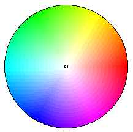

<div align="center">

## ColorWheel


</div>

### Description

Displays a color wheel on your monitor.
 
### More Info
 


<span>             |<span>
---                |---
**Submitted On**   |
**By**             |[Fastgraph boy](https://github.com/Planet-Source-Code/PSCIndex/blob/master/ByAuthor/fastgraph-boy.md)
**Level**          |Intermediate
**User Rating**    |4.6 (23 globes from 5 users)
**Compatibility**  |VB 3\.0, VB 4\.0 \(16\-bit\), VB 4\.0 \(32\-bit\), VB 5\.0, VB 6\.0
**Category**       |[Graphics](https://github.com/Planet-Source-Code/PSCIndex/blob/master/ByCategory/graphics__1-46.md)
**World**          |[Visual Basic](https://github.com/Planet-Source-Code/PSCIndex/blob/master/ByWorld/visual-basic.md)
**Archive File**   |[](https://github.com/Planet-Source-Code/fastgraph-boy-colorwheel__1-10006/archive/master.zip)


### Source Code

```
' Copyright © 2000 Phillip Senn<Phillip.Senn@alexlee.com>
' Freely distribute
' Special thanks to:
'  Lewis A. Shadoff, PhD http://websorcerer.com/h16/wheelie.html
Option Explicit
Const Radius = 127
Const PI = 3.14159265358979
Function ReduceTo255(nmbr, base) As Single
Dim hexVal As Integer
Dim dig1 As Integer
Dim dig2 As Integer
hexVal = nmbr * 255 / base
dig1 = hexVal Mod 16
dig2 = (hexVal - dig1) / 16
ReduceTo255 = dig2 * 16 + dig1
End Function
Function ColorValue(Color As String, ang As Single, vector As Single, xPos As Integer, yPos As Integer) As Single
'Calculate the color value for Red Green and Blue.
'Value is between 0 and 65535.
'For RED:
'In the area bounded by an angle of 60 degrees and 300 degrees value is 65535.
'(This is a right-hand-side quadrant)
'Outside this area the value decreases linearly from the boundary of the area to the edge of the circle on a line parallel to the x-axis.
'For GREEN:
'The coordinates must be rotated 120 degrees clockwise and x and y re-calculated.
'This transforms the circle so that the same calcualtion as for RED is valid.
'For BLUE:
'The coordinates are rotated 240 degrees.
Dim angCorr, angVal, xVal, yVal, X1, X2
If Color = "red.." Then angCorr = 0 * PI / 3
If Color = "green" Then angCorr = 2 * PI / 3
If Color = "blue." Then angCorr = 4 * PI / 3
angVal = ang - angCorr ' Apply rotation
If angVal < 0 Then angVal = angVal + 2 * PI ' If angle is negative, add 360 degrees
If Color = "red.." Then
 xVal = xPos
 yVal = yPos
Else
 xVal = Abs(vector * Cos(angVal))
 yVal = Abs(vector * Sin(angVal))
 If angVal > PI / 2 And angVal < 3 * PI / 2 Then
  xVal = -xVal ' Get the sign right
 End If
End If
If angVal <= 2 * PI / 6 Or angVal >= 10 * PI / 6 Then
 ColorValue = 65535 ' If inside the quadrant...
Else    ' If outside the quadrant...
 X1 = Sqr(Radius ^ 2 - yVal ^ 2) + xVal
 X2 = Abs(yVal) / Tan(PI / 3) - xVal
 ColorValue = 65535 * X1 / (X1 + X2)
End If
End Function
Private Sub Form_Activate()
'1) For each pixel within the Radius:
'2) Calculate vector, the distance from the center of the circle
'3) Calculate theta, the angle from the x-axis to the pixel (counterclockwise)
'4) Calculate the RGB values (0 to 65535)
'5) Convert to Hexadecimal values
'6) Place the pixel on the form
Dim cursX As Integer, cursY As Integer
Dim theta As Single
Dim thetaDeg As Single
Dim vector As Single
Dim X As Long, Y As Long
Dim R As Long, G As Long, B As Long ' Red, Green, Blue
X = Me.ScaleWidth / 2
Y = Me.ScaleHeight / 2
For cursX = -Radius To Radius
 For cursY = Radius To -Radius Step -1
  vector = Sqr(cursX * cursX + cursY * cursY)
  If vector <= Radius Then
   If vector = 0 Then vector = 1
   theta = aSin(Abs(cursY / vector))
   If cursX < 0 And cursY > 0 Then theta = 1 * PI - theta
   If cursX > 0 And cursY > 0 Then theta = 1 * theta
   If cursX < 0 And cursY < 0 Then theta = 1 * PI + theta
   If cursX > 0 And cursY < 0 Then theta = 2 * PI - theta
   thetaDeg = theta * 360 / 2 / PI
   R = ColorValue("red..", theta, vector, cursX, cursY)
   G = ColorValue("green", theta, vector, cursX, cursY)
   B = ColorValue("blue.", theta, vector, cursX, cursY)
   R = ReduceTo255(R, 65535)
   G = ReduceTo255(G, 65535)
   B = ReduceTo255(B, 65535)
   Me.PSet (cursX + X, -cursY + Y), RGB(R, G, B)
  End If
 Next cursY
Next cursX
End Sub
Private Function aSin(ByRef X As Variant) As Single
If X = 1 Then
 aSin = 0 ' This is why you see those red lines
Else
 aSin = Atn(X / Sqr(-X * X + 1))
End If
End Function
Private Sub Form_Load()
Me.ScaleMode = vbPixels
Me.WindowState = vbMaximized
End Sub
```

